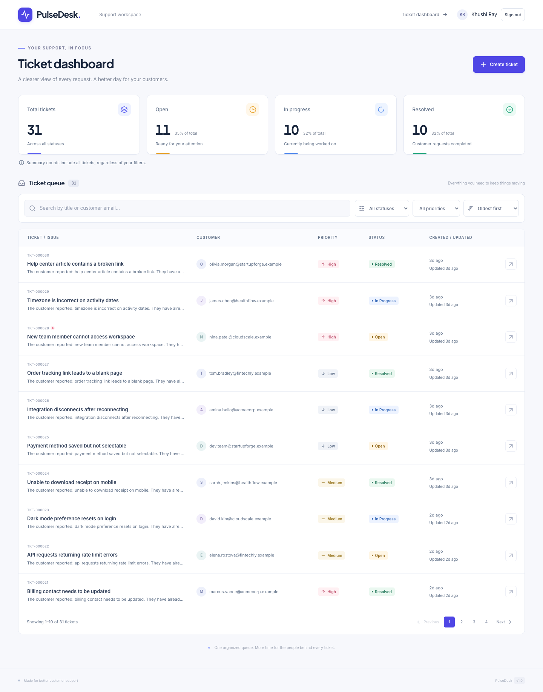
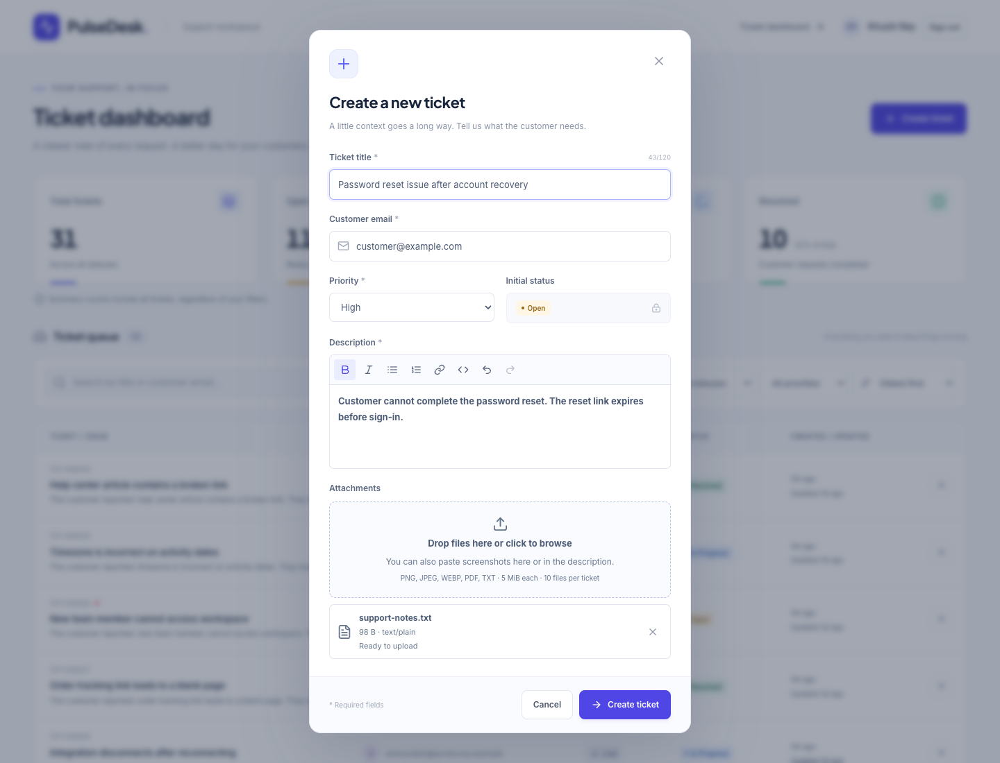
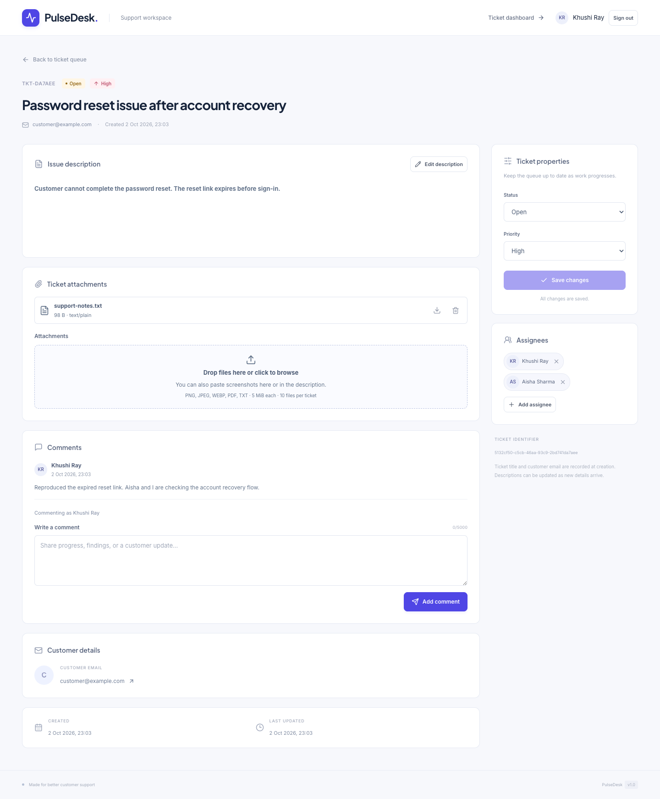
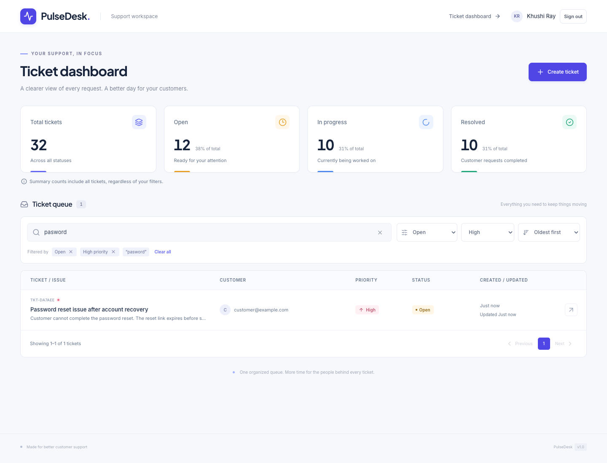
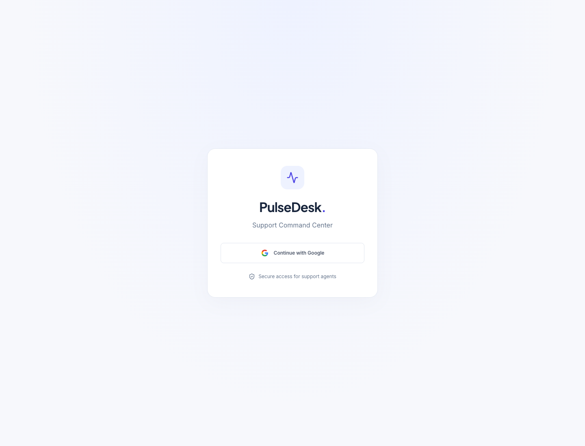

# PulseDesk

PulseDesk is a full-stack support ticket management dashboard built for the technical assignment. It allows support teams to create, search, filter, prioritize, update, and resolve customer requests through a centralized workspace. Built with React, Express, Prisma, and PostgreSQL.

## Core assignment features

- Create support tickets with a title, description, customer email, and priority; new tickets start with an Open status.
- Frontend and backend validation for required fields, email addresses, and allowed values.
- Search by ticket title or customer email.
- Filter by status and priority together with search.
- Sort by newest or oldest creation date.
- Backend pagination with 10 tickets per page and accurate result counts.
- Ticket detail view with complete customer and issue information.
- Update ticket status and priority, including resolving requests.
- Global total, open, in-progress, and resolved counts, independent of queue filters.
- Responsive desktop and mobile layouts.
- Loading, empty, and error states with retry controls.
- PostgreSQL persistence across refreshes and server restarts.
- Seed data for exploring the workflow.
- Automated API, database-isolation, and browser tests.

## Additional enhancements

The original assignment requirements were completed first. These optional enhancements were added afterward:

- Typo-tolerant fuzzy search using PostgreSQL `pg_trgm`.
- Rich-text descriptions with formatting and sanitization.
- File, image, PDF, and TXT attachments.
- Click-to-select, drag-and-drop, and clipboard-paste uploads.
- Multiple ticket assignees.
- Internal comments attributed to the signed-in support agent.
- Google OAuth / OpenID Connect authentication with protected pages and APIs.

## Screenshots

Captured from the running application using fictional seed/test data. The ticket detail view also shows multiple assignees and an authenticated comment.

### Dashboard



### Create Ticket



### Ticket Details



### Fuzzy Search

The misspelled query `pasword` finds a password-reset ticket while status, priority, and sorting controls remain active.



### Google Login



## Demo

A short demonstration video covering the complete ticket workflow can be added here:

[Watch the PulseDesk demo](ADD_DEMO_LINK_HERE)

**Before submission:** replace `ADD_DEMO_LINK_HERE` with your Loom or Google Drive video URL and verify that reviewers can access it.

## Quick start

Prerequisites: Node.js 24 LTS (or Node.js 22.12+), npm, and either PostgreSQL command-line tools or Docker with its daemon running. Google Chrome is needed only for browser tests.

Run from the repository root:

```sh
npm ci
cp server/.env.example server/.env
```

Choose **one** database option:

```sh
# Option A: installed PostgreSQL tools (initdb, pg_ctl, psql, createdb on PATH)
npm run db:local

# Option B: Docker
docker compose up -d --wait
```

Both options create `pulsedesk` and `pulsedesk_test` on `127.0.0.1:55432`. Then:

```sh
npm run db:generate
npm run db:migrate
npm run db:seed
npm run dev
```

Configure Google login using the instructions below, then open [http://127.0.0.1:5173](http://127.0.0.1:5173). The API runs on port 5000. Vite proxies `/api`, so the browser uses a single origin.

If using your own PostgreSQL instance, create separate development and test databases and update `server/.env` before migrating. The database does not need to use port 55432; that port keeps this project's optional local instance separate from the usual port 5432.

The seed also makes six deterministic support users available: Khushi Ray, Aisha Sharma, Rohan Mehta, Neha Kapoor, Arjun Rao, and Vikram Singh. User upserts match canonical email and preserve existing IDs and profile edits.

The seed inserts 30 realistic tickets with all nine status/priority combinations and varied timestamps. Re-running it preserves existing tickets and edits; it does not reset your data. Example email domains are fictional.

Fuzzy search requires PostgreSQL's `pg_trgm` extension, enabled by the new migration when you run `npm run db:migrate`. Existing installations should run that command once to apply the enhancement. The database role needs `CREATE` permission on the database to enable this trusted extension; alternatively, a database administrator can enable it before migrations run. See the [PostgreSQL pg_trgm documentation](https://www.postgresql.org/docs/14/pgtrgm.html).

## Environment

| Variable | Purpose | Default/example |
| --- | --- | --- |
| `DATABASE_URL` | Development PostgreSQL connection | See `server/.env.example` |
| `TEST_DATABASE_URL` | Separate database whose name ends in `_test` | See `server/.env.example` |
| `PORT` | Express listening port | `5000` |
| `HOST` | Express listening host | `127.0.0.1` |
| `APP_ORIGIN` | Browser origin for redirects and CSRF checks | `http://127.0.0.1:5173` |
| `GOOGLE_CALLBACK_URL` | Exact registered callback, on the app origin | `http://127.0.0.1:5173/api/auth/google/callback` |
| `GOOGLE_CLIENT_ID` | Google Web Application client ID, server only | Empty placeholder |
| `GOOGLE_CLIENT_SECRET` | Google client secret, server only | Empty placeholder |
| `SESSION_SECRET` | Random cookie signing secret, at least 32 characters | Empty placeholder; generate locally |
| `TRUST_PROXY` | Trust exactly one reverse proxy for HTTPS detection | Unset; use `1` only with that topology |
| `API_PROXY_TARGET` | Vite development/preview API target | `http://127.0.0.1:5000` |
| `ATTACHMENT_STORAGE_DIR` | Persistent local file directory (optional) | Project-root `.local/attachments` |
| `PLAYWRIGHT_EXECUTABLE_PATH` | Optional Chrome/Chromium executable for browser tests | Installed Google Chrome by default |

Environment files, local PostgreSQL data, build output, and test artifacts are ignored by Git. The optional native database is stored in `.local/postgres` and accepts local connections on loopback only. Its trust authentication is intended for this local development setup. The Docker option uses the example development credentials from the environment file.

If port 5000 is occupied, set `PORT` in `server/.env`, then launch with a matching proxy, for example:

```sh
API_PROXY_TARGET=http://127.0.0.1:5001 npm run dev
```

## Checks and tests

```sh
npm run lint
npm test
npm run test:e2e
npm run test:e2e:preview
npm run build
```

`npm test` runs 144 checks with Vitest and Supertest: the original 33 database-backed API tests, six test-database isolation checks, 13 fuzzy-search checks, 13 attachment checks, 14 rich-text checks, 21 collaboration checks, and 44 authentication/configuration checks. Coverage includes required-field/email/enum validation, persisted creation and updates, combined title/email search and filters, sorting (including identical creation timestamps), pagination metadata, literal wildcard searches, global counts, and consistent HTTP errors. Fuzzy-search coverage includes title/email typos, literal-match precedence, date sorting, combined filters, multiple pages and out-of-range pages, precise known-email lookup, unchanged response fields, and SQL-looking input.

`npm run test:e2e` runs 39 Playwright checks against the actual API and React application in Chrome. It verifies creation/update persistence after browser refresh, summary independence, query restoration after navigating to details, inline validation, modal focus/Escape, mobile layouts, loading, empty results, and retry behavior. It also checks retained input after failed mutations, prevention of duplicate submissions, protection against stale search responses, and fuzzy search through the existing dashboard with filters and sorting. Network failures and the empty-dataset UI are simulated with controlled browser routes; the normal create/update/query flows use PostgreSQL. Nine content tests cover formatted create/edit/reload, multiple attachments, paste and drag/drop, failed-upload retry without duplicate creation, validation/removal, persisted deletion, legacy descriptions, sanitization, mobile content controls, and JPEG/WEBP content detection/previews. Seven collaboration tests cover multiple assignment/add/remove/refresh, comments with authenticated authors and timestamps, failed comment submission and retained drafts, literal HTML comments, network recovery, assignment removal retry, and mobile layouts. Nine authentication browser checks cover login redirects, session loading without protected-content flashes, current-user name/avatar, refresh persistence, login-route redirect, content-only comment requests and authorship, logout, expired cookies, recoverable auth-check errors, and failed callbacks.

`npm run test:e2e:preview` builds the production bundle and runs the same 39 browser checks against Vite preview.

All test commands require an explicit `TEST_DATABASE_URL` whose database name ends in `_test`. They reject a test URL pointing at the development database, even when connection credentials or URL schema parameters differ. Tests migrate and reset only the test database. Each run also receives a generated `.local/test-attachments/<UUID>` storage directory, overriding any development storage setting, and removes it on completion. Run suites sequentially because they share test fixtures. Browser test servers use ports 5010 and 5174 and shut down afterward; they can run while the development app is open.

If Chrome is not installed, install it or set `PLAYWRIGHT_EXECUTABLE_PATH` to a compatible Chromium executable. Failure traces/screenshots are written to `test-results/`, with an HTML report in `playwright-report/`.

For a local preview of the production bundle:

```sh
npm run build
# Terminal 1
npm start
# Terminal 2
npm run preview -w client
```

For manual preview, set `APP_ORIGIN=http://127.0.0.1:4173` and `GOOGLE_CALLBACK_URL=http://127.0.0.1:4173/api/auth/google/callback` in `server/.env`, register that exact additional redirect URI in Google Cloud, and restart the API. Open `http://127.0.0.1:4173`. Restore the port-5173 settings before returning to development. This is a local preview, not a production deployment.

Stop the development application with Ctrl+C. Stop the optional native database with `npm run db:stop`, or stop Docker with `docker compose down`. Docker retains data in its named volume; the native setup retains `.local/postgres`.

## API contract

| Method | Path | Behavior |
| --- | --- | --- |
| POST | `/api/tickets` | Create from title, description, customerEmail, priority; status defaults to OPEN; 201 |
| GET | `/api/tickets` | Backend search/filter/sort/pagination; 200 |
| GET | `/api/tickets/summary` | Unfiltered total/open/inProgress/resolved counts; 200 |
| GET | `/api/tickets/:id` | Full ticket detail; 200 or 404 |
| PATCH | `/api/tickets/:id` | Update status, priority, and/or description; 200 or 404 |
| POST | `/api/tickets/:id/attachments` | Upload one multipart `file`; 201 |
| GET | `/api/tickets/:id/attachments` | List attachment metadata; 200 |
| GET | `/api/tickets/:id/attachments/:attachmentId/content` | Image preview or document download; `?download=1` forces download |
| DELETE | `/api/tickets/:id/attachments/:attachmentId` | Delete file and metadata; 200 or 404 |
| GET | `/api/users` | List support users in stable name/ID order |
| GET | `/api/tickets/:id/assignees` | List assignments with user profiles and assignment times |
| POST | `/api/tickets/:id/assignees` | Assign `{ userId }`; 201, duplicate 409 |
| DELETE | `/api/tickets/:id/assignees/:userId` | Remove only the assignment; 200 or 404 |
| GET | `/api/tickets/:id/comments` | List comments oldest first with author profiles |
| POST | `/api/tickets/:id/comments` | Post plain text `{ content }`; author comes from session; 201 |
| GET | `/api/health` | Local server availability check |

Example list query:

```text
/api/tickets?search=payment&status=OPEN&priority=HIGH&sort=newest&page=1&limit=10
```

Search preserves trimmed, case-insensitive exact and literal substring matching on title **or** email. It additionally accepts typo-tolerant matches, such as `pasword` for "Password reset issue" and `paymnt` for "Payment failed", through PostgreSQL trigram functions. Status and priority filters apply before ranking and pagination; the total count uses the identical match conditions.

Results rank full-field exact matches first, literal substring matches second, and fuzzy matches last. Fuzzy matches rank by decreasing similarity. Creation-date sorting is `newest` (default) or `oldest` within each literal group and between fuzzy matches with equal similarity; ID breaks remaining ties. Searches without a query retain the original date-only sorting. Every page contains at most 10 tickets. `page` defaults to 1; if supplied it must be a positive integer. Optional `limit` must equal 10. The endpoint parameters and response fields are unchanged.

Ordinary alphanumeric search words/phrases of at least four characters use `word_similarity` against title and email with a minimum score of 0.5. Email queries containing `@` use whole-email `similarity` with a minimum score of 0.6, and only add fuzzy results when there are no literal matches under the active filters. This keeps known customer-email searches precise. Short queries and punctuation-heavy queries remain literal; `%`, `_`, and backslashes retain their existing literal meaning. Thresholds are explicit in the service, with no connection-wide similarity settings or new API parameters.

```json
{
  "success": true,
  "data": {
    "tickets": [],
    "pagination": { "page": 1, "limit": 10, "total": 0, "totalPages": 0 }
  }
}
```

Ticket mutations/detail return the ticket directly inside `data`. A ticket includes `id`, `title`, `description`, `customerEmail`, `priority`, `status`, `createdAt`, and `updatedAt`; dates are ISO timestamps. Summary `data` contains `total`, `open`, `inProgress`, and `resolved`.

Allowed statuses: `OPEN`, `IN_PROGRESS`, `RESOLVED`. Priorities: `LOW`, `MEDIUM`, `HIGH`. Creation requires a nonblank title of at most 120 characters, a nonblank description, a valid email of at most 255 characters, and a priority. Unknown body/query fields are rejected. PATCH requires at least one editable field. IDs and timestamps are server-generated.

```json
{
  "success": false,
  "error": {
    "code": "VALIDATION_ERROR",
    "message": "Please check the supplied values.",
    "details": { "customerEmail": "Enter a valid customer email address." }
  }
}
```

Protected routes return `401 UNAUTHENTICATED` without a valid session and `403 INVALID_CSRF_TOKEN` for invalid mutation tokens/origins. Errors use 400 for invalid input/JSON, 404 for missing tickets/routes, 413 for request bodies larger than 1 MB, and 500 for unexpected failures. Unexpected failures are logged on the server with a safe message returned to the client.

## Architecture and implementation choices

```text
React + Vite + React Router + Tailwind CSS
                  | Axios / REST JSON
Express routes -> controllers -> Zod validation
                  | ticket services
               Prisma -> PostgreSQL
```

The modular monolith has one ticket domain with `Ticket`, `Attachment`, `User`, `TicketAssignee`, and `Comment` models plus a PostgreSQL session model. HTTP handling, validation, database queries, and error handling are separated. `server/src/app.js` can be tested without opening a port; `server/src/server.js` handles startup and shutdown. SQL migration files include enum/length/nonblank constraints and a creation-date/ID index.

List results and matching counts use a repeatable-read transaction so pagination metadata describes the same database snapshot. Search uses parameterized `Prisma.sql` / `$queryRaw` queries inside the existing ticket service to access trigram functions and ranking; user input is bound as data. Lists without search continue to use the existing Prisma model queries. Summary uses one unfiltered grouped query. There is no in-memory data store or frontend pagination. The extension migration changes no ticket fields or existing data; no new indexes are needed for the assignment's small dataset. Prisma 6 is pinned to match the schema-based configuration used here; the transitive `deepmerge-ts` dependency is overridden to its patched 8.x release and verified with generation, migrations, and tests. See the [Prisma 6 data-source documentation](https://docs.prisma.io/docs/orm/v6/prisma-schema/overview/data-sources).

The React UI uses small API hooks rather than an additional global state library. URL parameters retain the queue view, search is debounced by 300 ms, and aborted requests cannot overwrite newer results. Summary/list requests fail independently. The native dialog provides modal keyboard containment, explicit initial focus, Escape handling, and focus restoration. Fonts are bundled locally; there are no runtime font/CDN dependencies. Tailwind uses its [Vite integration](https://tailwindcss.com/docs/installation/using-vite).

## Attachments and rich descriptions

Run `npm run db:generate` and `npm run db:migrate` after upgrading. The additive `20261002010000_add_attachments` migration creates attachment metadata, a ticket foreign key with cascade deletion, a unique storage key, a per-ticket lookup index, and a file-size constraint. It does not rewrite existing descriptions or tickets. File bytes are never stored in PostgreSQL.

The storage boundary is `server/src/services/attachment-storage.js` (`write`, `read`, `remove` by generated key). Local files live in ignored `.local/attachments`, independent of the server's working directory; use `ATTACHMENT_STORAGE_DIR` to select another persistent directory. Back up both this directory and PostgreSQL. Restarting retains files. Replacing this adapter with object storage later does not change ticket business logic; there is no S3 infrastructure here.

Uploads use maintained Multer with bounded memory (one file per request, 5 MiB maximum) and at most 10 attachments per ticket. `file-type` detects PNG/JPEG/WEBP/PDF from bytes rather than trusting the browser's MIME value. TXT requires a `.txt` filename and strictly valid nonbinary UTF-8. Original filenames are cleaned for display; server-generated UUID keys determine storage paths. Keys and absolute paths are excluded from public metadata. Downloads use explicit MIME types, `nosniff`, a sandbox CSP, and attachment disposition for documents; images can render as thumbnails. Ticket/attachment IDs must be valid UUIDs and belong together. A ticket-row lock serializes concurrent uploads when enforcing the cap. A failed database write removes the newly written file; failed uploads preserve the ticket.

`AttachmentUploader` supports browsing, dropping, and clipboard files, and displays thumbnails, names, sizes, types, readiness, upload status, individual failures, and removal controls. Creation saves the ticket first, then uploads files sequentially. Partial failures keep the form and the saved ID: retry uploads, remove failed files and continue, or open the saved ticket. Successful files are not uploaded again. Existing tickets support additional uploads and attachment deletion.

`RichTextEditor` uses [TipTap React + StarterKit](https://tiptap.dev/docs/editor/getting-started/install/react), restricted to paragraphs, bold, italic, lists, links, inline code, code blocks, and undo/redo. The toolbar stays small. Pasted formatting is sanitized to supported elements. Clipboard files take precedence over clipboard text when both are present: image paste anywhere in the create form or description editor queues attachments, while ordinary text paste goes to the editor. Image drops in the editor also queue attachments. No image nodes or base64 data belong in description HTML.

The persisted format for formatted descriptions is **sanitized HTML in the existing `description` string**, preserving the API response fields. Legacy plain-text strings remain unchanged and render through React as text with preserved line breaks; strings containing HTML tags are treated as rich content. Editor initialization safely escapes plain text. Queue excerpts show text rather than HTML tags. PATCH additionally accepts `description`; a separate edit/save/cancel form on the detail page preserves existing property updates.

The backend uses [sanitize-html](https://github.com/apostrophecms/sanitize-html) with an explicit allowlist of supported tags and link attributes. Scripts, styles, event handlers, embedded media, images, and unsafe link schemes are stripped. The frontend sanitizes again with [DOMPurify](https://github.com/cure53/DOMPurify) before rendering and importing pasted HTML. Links use `noopener noreferrer`. Descriptions must contain visible text, including after sanitization; `<p></p>`, nonbreaking spaces, invisible characters, and image-only descriptions are rejected. Maximum size is 50,000 source HTML characters and 10,000 text characters.

Local storage serves a single application instance; shared/multiple-instance deployments need a shared volume or object-storage adapter. File signature checks are type validation, not malware scanning. There is no antivirus service, resumable upload, or distributed transaction between files and PostgreSQL. Ordinary write failures have compensation, but abrupt process/host failures can leave orphan files that require operational cleanup. Any future ticket-deletion service must remove associated files as well as cascading metadata.

## Collaboration: users, multiple assignees, and comments

Upgrade with `npm run db:generate`, `npm run db:migrate`, and `npm run db:seed`. The single additive `20261002020000_add_collaboration` migration creates `users`, `ticket_assignees`, and `comments`; it does not alter existing ticket/attachment columns or reset data. Existing tickets have zero assignments and comments. The ticket seed is unchanged apart from calling a separate deterministic user seed. Authentication is added separately by the additive migration documented below; there are no password credentials or roles.

`User` has a UUID identity, name, unique canonical lowercase/trimmed email, optional avatar URL, and creation/update timestamps. Comments and assignments reference this stable UUID; authentication resolves the signed-in principal to this same User without replacing collaboration relationships. Any future user-creation/profile-writing code must normalize email before persistence. Seeded email domains are fictional, and seed upserts preserve existing identities and profile edits.

`TicketAssignee` is an explicit join model with `(ticketId, userId)` as its primary key and `assignedAt`. The database rejects duplicates even for concurrent requests; the API returns `409 ALREADY_ASSIGNED`. Removing an assignment leaves its ticket and user intact. Assignments list by assignment time and user ID. Missing tickets/users and malformed UUIDs use the existing structured error format. Assignee chips and a keyboard-accessible Add chooser hide users already assigned. HTTPS avatars render when available, with initials as fallback for missing/failed images. Loading/error/retry states remain local to the collaboration panels.

`Comment` has a UUID, ticket/user foreign keys, plain-text content, and creation/update timestamps. The comment controller derives `userId` from the authenticated session while reusing the existing model/service relationship. The form has no author selector, and the strict content-only request schema rejects supplied `userId` fields. Comments reject blank or invisible-only text and have a 5,000-character maximum; HTML-looking text renders literally through React, without HTML parsing. Comments list oldest first with an ID tie-breaker, and include their author's profile and timestamp.

The comment form preserves the draft on failure, disables inputs and duplicate submissions while pending, clears the draft only on success, and reloads comments afterward. Assignments and comments persist independently of ticket properties, attachments, and description updates. Collaboration modules have dedicated routes, controllers, validators, and services; the existing ticket controller and fuzzy-search service are unchanged.

Ticket foreign keys cascade collaboration records when a ticket is deleted at the database boundary. Assignment-user deletion cascades only assignment rows, while comment-user deletion is restricted to preserve authorship. No user/ticket deletion endpoint is added. Comment edit/delete, dashboard assignee filtering, real-time synchronization, and comment pagination are intentionally absent. Large comment histories will need separate pagination work. The collaboration model remains unchanged by authentication.

## Authentication and Google login

The server uses maintained [openid-client](https://github.com/panva/openid-client) for OpenID Connect discovery, code exchange, ID-token validation (including signatures), PKCE, state and nonce checks. The React app starts login through Express; secrets and provider tokens never enter the frontend. Only `openid email profile` are requested. No Google password, Gmail scopes, refresh tokens, or mailbox integration are used.

### Exact local Google Cloud setup

1. In [Google Cloud Console](https://console.cloud.google.com/), create or select a project. Open **Google Auth Platform** (OAuth consent configuration).
2. Under **Branding**, configure the app name **PulseDesk**, user support email, and developer contact email. Under **Audience**, choose **Internal** for a Workspace organization when available, or **External** with **Testing** status for personal/local development. For an External Testing app, add the Google accounts that will sign in as test users.
3. Under **Data Access**, configure only the identity scopes `openid`, `https://www.googleapis.com/auth/userinfo.email`, and `https://www.googleapis.com/auth/userinfo.profile` (the corresponding request scopes are `openid email profile`). No Gmail API needs to be enabled.
4. Under **Clients**, create an OAuth client with application type **Web application**, named **PulseDesk local**.
5. This server-side redirect flow does **not require Authorized JavaScript origins** because the browser does not use a Google JavaScript SDK. If an origin is entered for this client, use exactly `http://127.0.0.1:5173` without a path.
6. Add this exact **Authorized redirect URI**: `http://127.0.0.1:5173/api/auth/google/callback`. The callback intentionally goes through Vite's `/api` proxy, not port 5000. Keep `127.0.0.1` consistent; `localhost` is a different browser origin and requires its own matching settings/registered URI.
7. Copy the generated client ID and client secret into ignored `server/.env`. Generate `SESSION_SECRET` with `node -e "console.log(require('node:crypto').randomBytes(48).toString('base64url'))"`. Save it only in the local environment file; use a secrets manager in production.

```dotenv
APP_ORIGIN=http://127.0.0.1:5173
GOOGLE_CALLBACK_URL=http://127.0.0.1:5173/api/auth/google/callback
GOOGLE_CLIENT_ID=
GOOGLE_CLIENT_SECRET=
SESSION_SECRET=
```

These are placeholders: populate them locally before real sign-in. Run `npm run db:generate` and `npm run db:migrate`, then restart `npm run dev` and visit `/login`. Google's [OpenID Connect setup instructions](https://developers.google.com/identity/openid-connect/openid-connect) describe the provider configuration. Automated tests do not need these credentials.

The app starts without Google credentials in development: the login screen remains accessible, but Continue with Google reports that login is unavailable and protected data remains inaccessible. If `SESSION_SECRET` is omitted in development, a random process-local secret is used; restarting then invalidates cookies. Set a stable random secret to retain sessions across restarts. Production fails startup without a sufficiently long secret, Google credentials, and an HTTPS app origin. Real Google sign-in must be smoke-tested after configuring a Cloud client; the automated flow mocks Google's network boundary.

### Session architecture and API

[express-session](https://expressjs.com/en/resources/middleware/session/) and [connect-pg-simple](https://github.com/voxpelli/node-connect-pg-simple) store sessions in the existing PostgreSQL database, without Redis. The additive `20261002030000_add_auth_sessions` migration adds nullable unique `User.googleSubject`, nullable `User.lastLoginAt`, and an indexed `sessions` table. It preserves existing user IDs, assignments, comments, and tickets. No separate authentication user table is introduced.

The cookie `pulsedesk.sid` contains only a signed, random session ID. It is HttpOnly, SameSite=Lax (supports the Google callback), and Secure when `NODE_ENV=production`. Authentication expires eight hours after sign-in, regardless of activity. Login regenerates the session ID; logout destroys the database session and clears the cookie. Session rows hold the user ID, authentication time, CSRF token, cookie metadata, and a short-lived single-use OAuth transaction; Google tokens are discarded. Expired rows are pruned every 15 minutes by the store. Neither JWTs nor provider tokens are stored in localStorage.

| Method | Endpoint | Behavior |
| --- | --- | --- |
| GET | `/api/auth/me` | Current safe `{ id, name, email, avatarUrl }` profile; 401 if unauthenticated |
| GET | `/api/auth/csrf` | Authenticated session's CSRF token for mutation headers |
| GET | `/api/auth/google` | Create state/nonce/PKCE transaction and redirect to Google |
| GET | `/api/auth/google/callback` | Validate callback, link user, regenerate session, redirect to `/dashboard`; safe failures redirect to `/login?error=...` |
| POST | `/api/auth/logout` | Require authentication and CSRF; invalidate session and return `data: null` |

Shared `requireAuth` middleware protects all ticket/user reads and mutations, including attachment bytes. `requireCsrf` validates `X-CSRF-Token` and rejects a supplied Origin different from `APP_ORIGIN` on mutations. The Axios client fetches the token into memory before mutations. APIs retain their existing envelopes and response fields; comments deliberately change from `{ userId, content }` to `{ content }` and reject impersonation fields. Assignments can still target any existing support user.

`AuthProvider`, `AuthGate`, and `LoginPage` manage current-user state and routing. Until `/api/auth/me` completes, only a session-loading state appears. Logged-out protected routes redirect to `/login`; signed-in `/login` redirects to `/dashboard`. The header shows the current name/avatar or initials and sign-out. Failed session checks offer retry; API 401s return the UI to login.

### Linking existing support users

After the library validates Google's identity, the server requires `email_verified=true`. A previously linked Google subject always resolves to its original User ID. On first login, canonical verified email matches an existing **unlinked** User and records `googleSubject` on that same row; otherwise a new User is created. Email and Google subject are unique, and serializable transactions with conflict retries handle simultaneous logins. An email linked to a different subject is rejected. Existing names/profile edits are preserved; a missing avatar can be filled from Google's HTTPS picture. New users receive Google's name/avatar. Later email changes do not reassign identities or automatically rewrite stored email.

This automatic first-email link intentionally trusts verified Google email ownership for existing unlinked records. Provision real, accurately owned support emails before deployment. The fictional `@pulsedesk.example` seeded users cannot be signed into with real Google accounts; a real Google account creates a new support user unless an accurately matching existing record was provisioned. Old manual comments and assignments keep their IDs/authors. From this phase onward, new comment authors come exclusively from the session.

### Test strategy and production limits

The existing API regressions use signed database session fixtures, protected by `NODE_ENV=test`, a verified dedicated `_test` database, and the test runner. OAuth API tests mock only `openid-client` discovery/code exchange and inspect the real adapter's state/nonce/PKCE/scope parameters. Browser tests use a separate guarded test-server entry point with a mocked provider; it is never imported by the production server. No test login route, production bypass, or environment-selected fake identity exists in the normal app. Fixtures still exercise real cookies, PostgreSQL sessions, middleware, CSRF, controllers, and persistence.

44 new API/configuration checks cover protected endpoints, safe profiles, session reuse/rotation/logout/expiry, CSRF and cross-origin requests, identity-only OAuth parameters, missing/wrong/duplicate/expired state, provider failure and transaction replay, unverified emails, stable linking, concurrency, comment impersonation, assignees, and fail-closed production configuration. Nine new browser checks exercise the real login/session boundary with a mocked Google exchange, alongside all 30 earlier browser regressions.

Production needs HTTPS, a stable secret shared by application instances, a production Web Application OAuth client with the exact HTTPS callback, protected PostgreSQL credentials/backups, and a single browser/API origin. If TLS terminates at **exactly one trusted proxy**, set `TRUST_PROXY=1`, ensure it replaces forwarded headers, and prevent clients from reaching Express directly. Other proxy topologies require an explicit trust configuration before deployment. Run with `NODE_ENV=production`; a production frontend build alone does not enable server cookie security. PostgreSQL sessions support shared identity state, but attachments still need shared persistent storage for multiple instances.

There are no roles, invitations, agent allowlists, administrative onboarding, account unlinking, or global sign-out from every device in this phase. With External consent, any verified Google account permitted by that project's audience can create a support user and access the dashboard. For a private organization, choose an Internal Workspace audience; a stricter application-level admission policy is separate work. Signing out invalidates the current PulseDesk session, not the user's Google account. Google/network availability is required for new logins; already authenticated requests use local database sessions.

## Scope distinction

The original assignment requirements were completed first.

Fuzzy search, attachments, rich-text editing, multiple assignees, internal comments, and Google authentication are optional enhancements added afterward to demonstrate how the application could evolve into a more realistic support workflow. They were not required by the original assignment.

## Assumptions and limitations

- Medium is preselected in the create form as an implementation assumption; the API requires priority explicitly.
- Tickets use UUIDs, shortened in the queue and shown fully in details. Status, priority, and description are editable after creation; title and customer email remain fixed.
- Creating a ticket opens its detail page so it can be found even when active queue filters would exclude it. Returning restores the previous queue query and refreshes its data.
- Timestamps are stored with timezone support and displayed in the browser's local timezone. Seed dates are relative to the first seed run and remain stable on subsequent runs.
- The small Needs Attention dot is derived from HIGH priority and OPEN status; it is not a stored field or an additional query mode.
- Gmail integration, notifications, analytics, audit history, ticket deletion, and deployment remain outside this enhancement's scope.
- Concurrent edits use last-write-wins behavior. There is no real-time synchronization or optimistic concurrency control.
- Querying uses exact, substring, and trigram matching with offset pagination, which suit the assignment dataset; large datasets would need separate performance work.
- The native PostgreSQL path was verified with PostgreSQL 14.17 on macOS. Docker Compose is provided as an alternative; Docker startup was not verified here because its daemon was unavailable.

## AI-assisted development

AI-assisted development tools were used during the project for planning, implementation support, debugging, test-case generation, and code review.

The architecture, implementation decisions, integrations, and final code were reviewed and verified through automated and manual testing. The database schema, API design, frontend flows, authentication, search, attachments, collaboration features, and tests are documented in this repository for review and discussion.

## Time spent

Core assignment implementation: approximately **X hours**.

Optional enhancements and additional testing: approximately **Y hours**.

**Before submission:** replace `X` and `Y` with truthful values based on your own time records. These placeholders are not estimates.

The original 4–6 hour assignment window was used to prioritize the required ticket-management workflow first. Additional enhancements such as fuzzy search, attachments, rich-text descriptions, collaboration features, and Google authentication were implemented afterward.

## Project references

Requirements: [PRD](docs/PulseDesk_PRD.pdf). Architecture: [architecture.md](docs/architecture.md). Milestones and acceptance mapping: [development-plan.md](docs/development-plan.md). Static visual references remain in `design/`.

## Submission checklist

- [x] Application source code
- [x] Database migrations
- [x] Seed instructions
- [x] Setup instructions
- [x] Environment variable documentation
- [x] Test instructions
- [x] Technical choices
- [x] Assumptions
- [x] Known limitations
- [ ] Final time-spent values reviewed
- [ ] Demo video link added
- [x] Screenshots included
